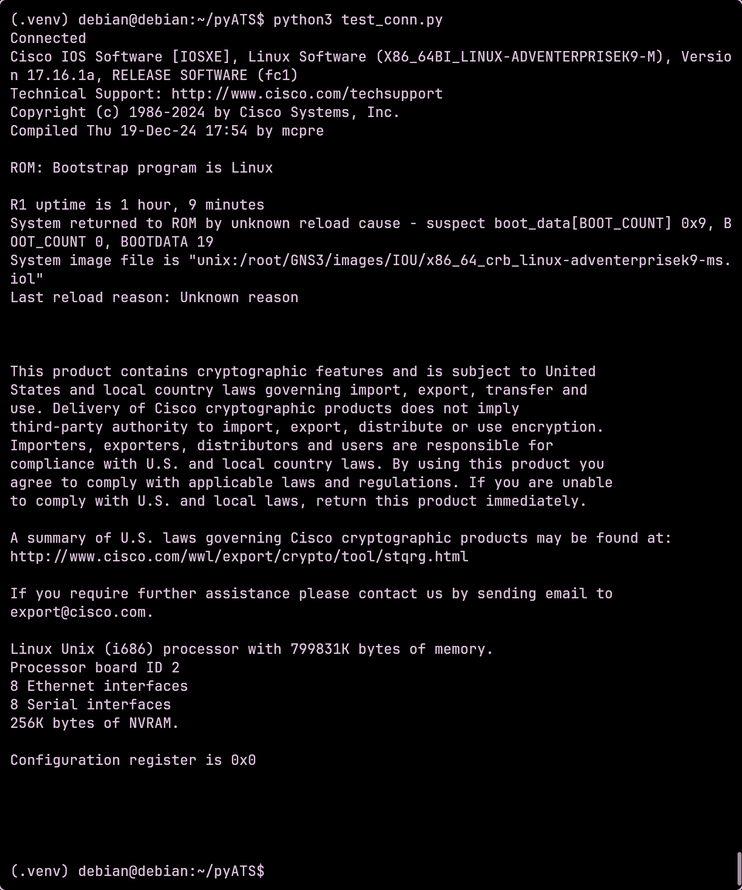

# This is my test project for my upcoming bachelor's thesis
This project is still very much work in progress. Sections will be gradually added as the setup develops and the workflow becomes functional.
The project is to set up a virtual GNS3 network bridged to my host client.

This approach allows Ansible to automatically push new valid configurations on the network devices.

# The topology


# Basic workflow

The automation node will run Ansible, pyATS and a CI runner. The CI runnel will receive pipeline jobs when new changes are pushed to the GitHub repository.

If the tests pass, Ansible will apply the new configurations to the network devices. If the tests fail, the changes will be rejected.

# Device configurations

We only need the following initial configurations on the network devices

* ip address
* ssh access

# IP table

| device                           | management ip |
| -------------------------------- | ------------- |
| R1                               | 192.168.99.1  |
| S1                               | 192.168.99.2  |
| Debian - Automation control node | 192.168.99.3  |
| Developer workstation            | 192.168.99.10 |

The GNS3 management network is reachable from the local machine. SSH access has been configured and tested.

# Workstation NAT and fowarding configuration

For this project to work, the Automation control node must use the developer workstation as its default gateway. The workstation also needs to perform NAT so that any internet-bound traffic from the Ansible control node is translated and appears to originate from the workstation.
Internet access is required for the Automation control node so it can interact with the remote Git repository and retrieve the latest configuration changes, Ansible playbooks and inventory.

NAT is enabled by the following command on the workstation.
`sudo iptables -t nat -A POSTROUTING -s 192.168.99.3/32 -o eth0 -j MASQUERADE`

Forwarding rules are also required so that traffic can pass between the GNS3 management network and the workstation's WAN interface.

`sudo iptables -A FORWARD -i tap0 -o wlp0s20f3 -s 192.168.99.3/32 -j ACCEPT`

`sudo iptables -A FORWARD -i wlp0s20f3 -o tap0 -d 192.168.99.3/32 -m conntrack --ctstate RELATED,ESTABLISHED -j ACCEPT`

The first rule allows the Automation control node to initiate outbound connections to the internet.
The second rules allows return traffic for established connections back to the Automation control node. It does not allow connections to be initiated from the outside network.

# Ansible structure

```text
ansible/
├── ansible.cfg
├── inventory/
│   ├── hosts.yml
│   └── group_vars/
│       └── all.yml
└── playbooks/
    └── test_connectivity.yml
```

## Inventory

```
all:
  children:
    routers:
      hosts:
        R1:
          ansible_host: 192.168.99.1
    switches:
      hosts:
        S1:
          ansible_host: 192.168.99.2

```

## Group variables

All the shared Ansible connection settings are stored in its own file located at `inventory/group_vars/all.yml`
SSH credentials are read from environment variables instead of being directly shown as plaintext on the repository.

The .env file is excluded from the repository.

Example of the `.env` file:

```
ssh_user=username
ssh_pass=password
```

Ansible is not able to automatically read them from the file. They have to be exported to your system environment variables.

## Test playbook

The first playbook verifies that Ansible can connect to the network devices and can run commands. The playbook is located at `ansible/playbooks/show_version`

the playbook is run from `/ansible` directory:
`ansible-playbook playbooks/show_version.yml`

Running the playbook shows the `show version` command output in the terminal and successfully runs on both devices.


# Automation control node configuration

The Automation control node requires the installation of Ansible and the necessary network collection. The following are required to interact with Cisco IOS devices:

`pip install ansible-core`

`ansible-galaxy collection install cisco.ios ansible.netcommon`

Git will also be installed on the Automation control node so it can retrieve the latest playbooks, inventory files and configuration files from the remote repository. A git CI runner will be also installed. It allows the node
to automatically fetch the repository and run the required Ansible playbooks whenever changes are pushed.

`sudo apt install git`

pyATS will be used as part of the validation stage to automate network tests. If the tests pass, the pipeline can proceed with pushing the configuration changes to the managed devices.

`pipx install 'pyats[full]'`

# pyATS configuration

Create a Python3 virtual environment on the and activate it and install pyats[full] via pip.

```text
python3 -m venv venvname
source venvname/bin/activate
pip install 'pyats[full]'
```

## testbed.yaml

A testbed.yaml is used as the inventory for pyATS. It specifies the devices names, types, operating systems, credentials etc. Necessary information for pyATS to initiate SSH connection and run the correct commands on the device.
This testbed.yaml was manually written, but it is also possible to write a testbed file from ansible inventory for example if it's made already.

```yaml
testbed:
 credentials:
   default:
     username: "%ENV{ssh_user}"
     password: "%ENV{ssh_pass}"

devices:
 R1:
   alias: 'Office router R1'
   type: 'router'
   os: 'ios'
   connections:
     cli:
       protocol: ssh
       ip: 192.168.99.1
       port: 22


 S1:
   alias: 'Office switch S1'
   type: 'switch'
   os: 'ios'
   connections:
     cli:
       protocol: ssh
       ip: 192.168.99.2
       port: 22
```

This requires to create a .env file in the directory with two variables
`ssh_user=x` and `ssh_pass=x`

## Testing pyATS connectivity

First we test pyATS connectivity with a Python script. The script connects into R1 and runs the `show version` command on the device and outputs it to the terminal.

```python
from pyats.topology import loader

testbed = loader.load('testbed.yaml')
device = testbed.devices['R1']

try:
    device.connect(log_stdout=False)
    print("Connected")
    print(device.execute('show version'))

except Exception as e:
    print(f"Failed: {e}")

finally:
    if device.connected:
        device.disconnect()
```



The script successfully connects to device R1 and runs the 'show version' command. This confirms our connectivity is working.
