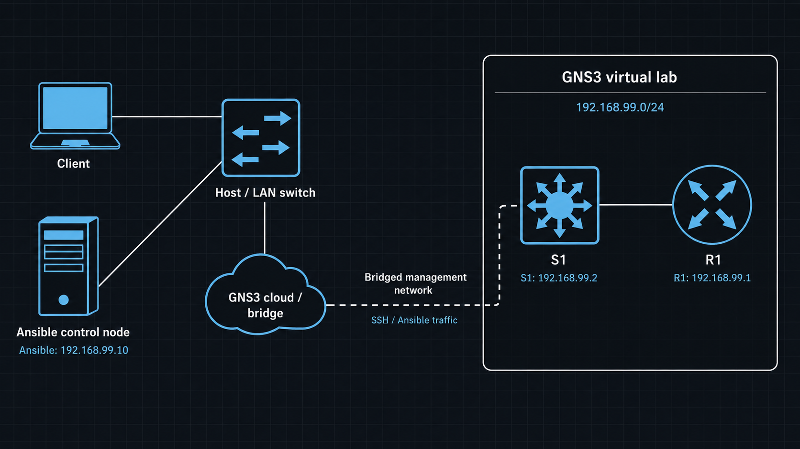
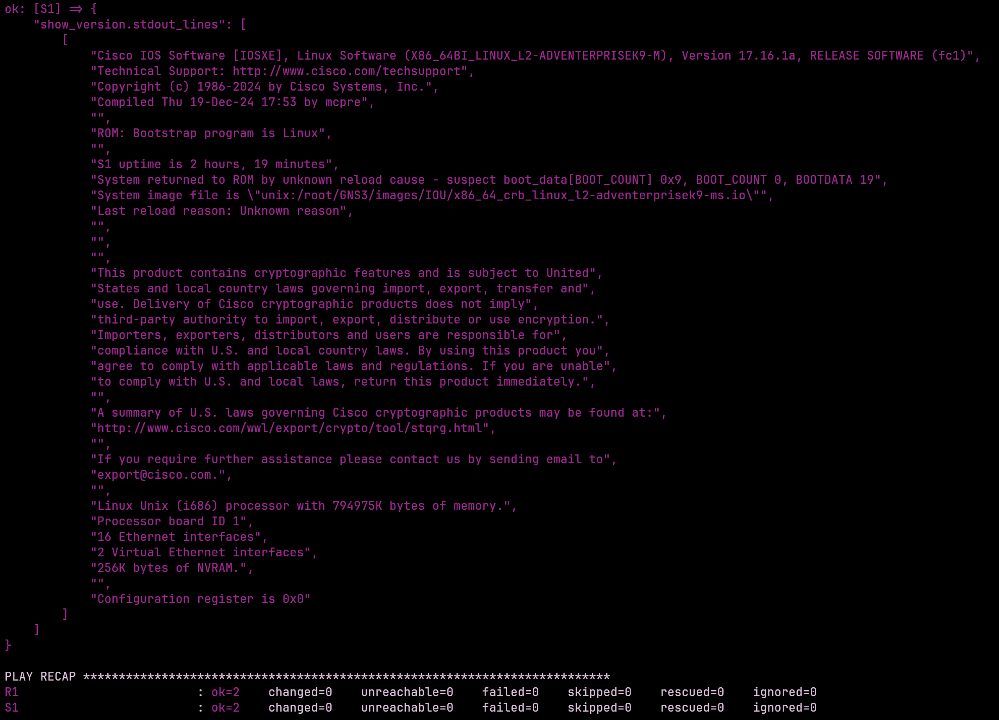

## this is my test project for my upcoming bachelor's thesis

The project is to set up a virtual GNS3 network bridged to my host client.

this approach allows Ansible to automatically push new valid configurations on the network devices.

# the topology


# basic workflow
The Ansible control node will run Ansible and monitor a GitHub repository for new commits. when configuration changes are detected, an automated CI/CD pipeline will be triggered. The pipeline will use pyats to test and validate the proposed configuration changes.

If the tests pass, ansible will apply the new configurations to the network devices. if the tests fail, the changes will be rejected.


# device configurations
We only need the following initial configurations on the network devices
- ip address
- ssh access


# ip table

|device | management ip |
|------------|-----------|
| r1 | 192.168.99.1 |
| s1 | 192.168.99.2 |
| debian - ansible control node| 192.168.99.3 |
| developer workstation | 192.168.99.10 |

the gns3 management network is reachable from the local machine. ssh access has been configured and tested.

# Specific configuration for this project
 
For this project to work, the Ansible control node must use the developer workstation as it's default gateway. The workstation also needs to perform NAT so that any internet-bound traffic from the Ansible control node is translated at appears to originate from the workstation.
Internet access is required for the Ansible control node so it can interact with the remote Git repository and retreive the latest configuration changes, Ansible playbooks and inventory.

NAT is enabled by the following command on the workstation.
`sudo iptables -t nat -A POSTROUTING -s 192.168.99.3/24 -o eth0 -j MASQUERADE`

Forwarding rules are also required so that traffic can pass between the GNS3 management network and the workstatstion's WAN interface.

`sudo iptables -A FORWARD -i tap0 -o wlp0s20f3 -s 192.168.99.3/32 -j ACCEPT`
`sudo iptables -A FORWARD -i wlp0s20f3 -o tap0 -d 192.168.99.3/32 -m conntrack --ctstate RELATED,RSTABLISHED -j ACCEPT`

The first rule allows the Ansible control node to inititate outbound connections to the internet. 
The second rules allows return traffic for estalished connections back to the Ansible control node. It does not allow connections to be inititated from the outside network.

Ansible has been configured successfully. The current Ansible configurations allows access to R1 and S1 and run Cisco IOS commands with the 'cisco.ios.ios_command' module.

## Ansible structure

```text
ansible/
├── ansible.cfg
├── inventory/
│   ├── hosts.yml
│   └── group_vars/
│       └── all.yml
└── playbooks/
    └── test_connectivity.yml
```

## Inventory
```
all:
  children:
    routers:
      hosts:
        R1:
          ansible_host: 192.168.99.1
    switches:
      hosts:
        S1:
          ansible_host: 192.168.99.2

```

## Group variables

All the shared Ansible connection settings are stored in its own file located at `inventory/group_vars/all.yml` 
SSH credentials are read from environment variables instead of being directly shown as plaintext on the repository.

The .env file is excluded from the repository.

Example of the `.env` file:

```
ssh_user=username
ssh_pass=password
```

Ansible is not able to automatically read them from the file. They have to be exported to your system environment variables.

## Test playbook

The first playbook verifies that Ansible can connect to the network devices and can run commands. The playbook is located at `ansible/playbooks/show_version`

the playbook is run from `/ansible` directory:
`ansible-playbook playbooks/show_version.yml`

Running the playbook shows the `show version` command output in the terminal and succesfully runs on both devices.



## 

 We need to install Ansible and Ansible collections, specifically the cisco.ios and ansible.netcommon.

 `pip install ansible`

 `ansible-galaxy collection install cisco.ios ansible.netcommon`


